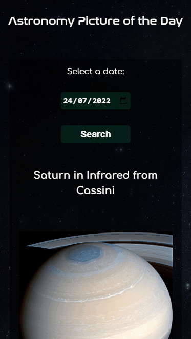

<h1 align="center">
	

</h1>
 

<h3 align="center">
  Astronomy Picture of the Day
</h3>
 
 

## Sobre 

Astronomy Picture of the Day (APOD) mostra a imagem ou vídeo astronômica do dia, buscando os dados da API oficial da NASA. Você pode ver APOD de data diferente.

## Layout

💻 Desktop  | 📱 Mobile
:---:|:---:
  |  

## Página

Para visitar a página clique [aqui](https://1995william.github.io/Projeto-APOD-Resilia/)

## Ferramentas e tecnologias

- HTML5
- CSS3
- Jquery
- AJAX
- Javascript
- VS Code

##  Desenvolvedor

[Rodrigo William](https://www.linkedin.com/in/rodrigo-william1/)

## License

This project is licensed under the MIT License - see the [LICENSE](LICENSE) file for details.